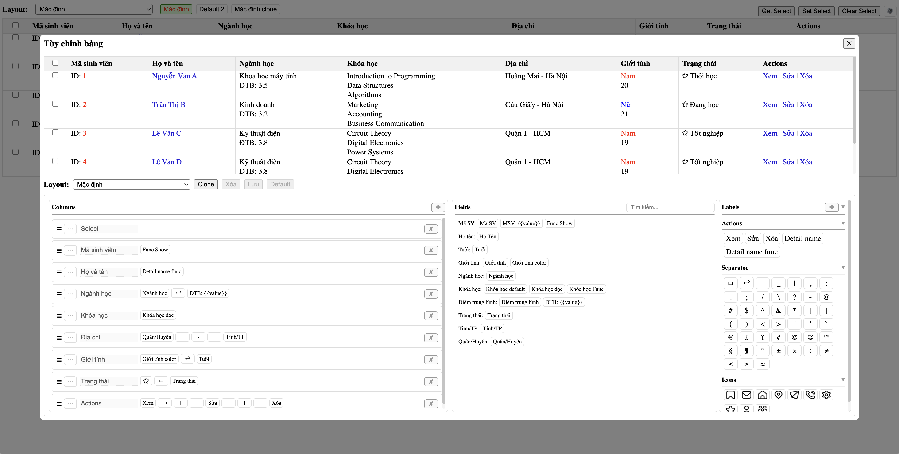

# Vue3 Flexi Data Table

A flexible data table component for Vue 3 with rich features.

## Features

- 🔄 Dynamic column configuration
- 📱 Responsive design
- ✨ Rich data display options
- 🎯 Custom field rendering
- 🔍 Column sorting
  - Configure sortable fields in column editor
  - Click header to cycle through sort states (ascending → descending → no sort)
  - Only one column can be sorted at a time
- ✅ Row selection
  - Single/Multiple row selection
  - Select all/Deselect all
  - Get/Set selected rows programmatically
- 🎨 Flexible styling
  - Column alignment (horizontal & vertical)
  - Custom width settings (fixed, min, max)
  - Custom CSS for header and cells
- 🏷️ Label system
  - Create and manage custom labels
  - Style labels with colors and sizes
- 🛠️ Rich customization options
  - Column reordering via drag & drop
  - Column type support (data/select)
  - Symbol and icon integration

## Screenshot



## License

MIT

## Author

### Tanmv

- GitHub: [tanmv](https://github.com/mvtcode)

### Contact for work

- Email: tanmv@mpos.vn
- Telegram: @tanmac
- Skype: trai_12a1

## Installation

```bash
npm install vue3-flexi-data-table
```

## Components

### DynamicTable

The main table component that displays data with configured columns.

```vue
<template>
  <DynamicTable 
    :columns="columns"
    :data="data"
    :templates="templates"
    :labels="labels"
    :height="400"
    :fixed="true"
    @sortChange="handleSort"
    @selectChange="handleSelect"
    @onCta="handleAction"
  />
</template>
```

### TableEditor

A component for configuring table columns with drag-and-drop support.

```vue
<template>
  <TableEditor
    v-model="columns"
    :vfFields="fields"
    :actions="actions"
    :icons="icons"
    :labels="labels"
    :height="400"
    @update:labels="handleLabelUpdate"
  />
</template>
```

## Usage Examples

### Basic Table with Sorting

```vue
<template>
  <DynamicTable 
    :columns="columns"
    :data="data"
    @sortChange="handleSort"
  />
</template>

<script setup>
import { ref } from 'vue';
import { DynamicTable } from 'vue3-flexi-data-table';

const columns = ref([
  {
    title: 'Name',
    fieldCodes: ['name'],
    sortField: 'name' // Enable sorting for this column
  },
  {
    title: 'Age',
    fieldCodes: ['age'],
    sortField: 'age',  // Enable sorting for this column
    align: 'right'     // Right align numbers
  }
]);

const data = ref([
  { name: 'John Doe', age: 30 },
  { name: 'Jane Smith', age: 25 },
  // ... more data
]);

// Handle sort changes
const handleSort = (sort) => {
  const { field, direction } = sort;
  // Implement your sorting logic here
};
</script>
```

### Table with Selection

```vue
<template>
  <DynamicTable 
    ref="tableRef"
    :columns="columns"
    :data="data"
    @selectChange="handleSelect"
  />
  <button @click="selectFirstRow">Select First Row</button>
  <button @click="clearSelection">Clear Selection</button>
</template>

<script setup>
import { ref } from 'vue';
import { DynamicTable } from 'vue3-flexi-data-table';

const tableRef = ref();
const columns = ref([
  {
    type: 'SELECT',    // Add checkbox column
    width: '40px'
  },
  {
    title: 'Name',
    fieldCodes: ['name']
  }
]);

// Handle selection changes
const handleSelect = (selectedRows) => {
  console.log('Selected rows:', selectedRows);
};

// Example of using table methods
const selectFirstRow = () => {
  tableRef.value.setSelect([0]);
};

const clearSelection = () => {
  tableRef.value.clearSelect();
};
</script>
```

### Table with Custom Templates

```vue
<template>
  <DynamicTable 
    :columns="columns"
    :data="data"
    :templates="templates"
  />
</template>

<script setup>
import { ref } from 'vue';
import { DynamicTable } from 'vue3-flexi-data-table';

const templates = ref([
  {
    vfCode: 'status',
    vfType: 'DATA',
    vfRenderFunc: (row) => {
      return row.status === 'active' ? '🟢 Active' : '🔴 Inactive';
    }
  }
]);

const columns = ref([
  {
    title: 'Status',
    fieldCodes: ['status']
  }
]);

const data = ref([
  { status: 'active' },
  { status: 'inactive' }
]);
</script>
```

## Props

### DynamicTable Props

| Prop | Type | Default | Description |
|------|------|---------|-------------|
| columns | Column[] | [] | Array of column configurations |
| data | any[] | [] | Array of data to display |
| templates | VfField[] | [] | Array of field templates |
| labels | LabelField[] | [] | Array of label configurations |
| height | number | - | Fixed height of the table |
| fixed | boolean | false | Whether to fix the table height |

### TableEditor Props

| Prop | Type | Default | Description |
|------|------|---------|-------------|
| modelValue | Column[] | [] | Array of column configurations |
| vfFields | VfField[] | [] | Array of field templates |
| actions | VfField[] | [] | Array of action templates |
| icons | VfField[] | [] | Array of icon templates |
| labels | LabelField[] | [] | Array of label configurations |
| height | number | 390 | Height of the editor |
| disabled | boolean | false | Whether the editor is disabled |
| labelPresets | LabelPreset[] | [] | Array of label style presets |

## Events

### DynamicTable Events

| Event | Parameters | Description |
|-------|------------|-------------|
| sortChange | { field: string, direction: 'asc' \| 'desc' } | Emitted when sort changes |
| selectChange | number[] | Emitted when selection changes |
| onCta | (action: string, row: any, index: number) | Emitted when a custom action is triggered |

### TableEditor Events

| Event | Parameters | Description |
|-------|------------|-------------|
| update:modelValue | Column[] | Emitted when columns are updated |
| update:labels | LabelField[] | Emitted when labels are updated |
| error | string | Emitted when an error occurs |